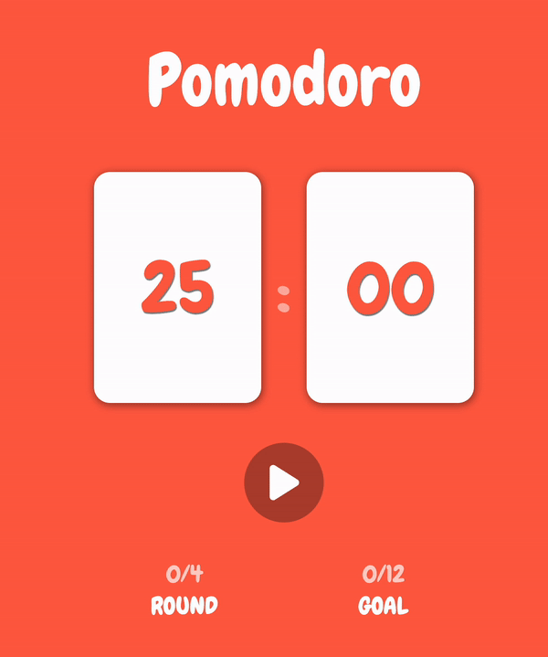

<p>


</p>

## 🐹 프로젝트 개요

뽀모도로 앱

- 재생 / 일시정지 버튼
- 25분 카운트 다운
- 25분 완료시, 1 Round 카운트 업
- 4 Round 완료시, 1 Goal 카운트 업

## 🚀 프로젝트 확인 해보기

[배포페이지에서 확인하기](https://pomodoro-j2h30728.vercel.app/)<br/>

## 🗓️ 프로젝트 제작

제작 : 2023.6.8. ~ 6.11

## 👀 홈페이지 프리뷰



## 📌 프로젝트 실행 방법

1. Clone the repo

```javascript
$ git clone https://github.com/j2h30728/pomodoro.git
```

2. Install NPM packages

```javascript
$ npm install
```

3. Getting Started

```javascript
$ npm run dev
```

<br/>
